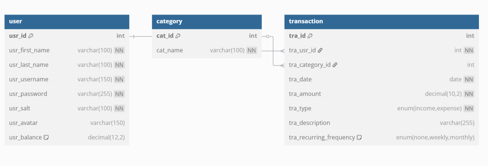

# Final Team Project

## Wolfpack Budget Planner

## Progress Report

### Completed Features

*   **User Authentication:** Secure user registration and login system using password hashing (PBKDF2+salt) and JWT stored in HTTP-only cookies.
*   **Dashboard:** Displays key financial summaries ("Spent this Month", "Unallocated Cash") and an interactive calendar view of transactions.
*   **Income Management:** Users can add, **edit (via modal)**, view (on Report page), and delete income records. Recurring income is supported.
*   **Expense Management:** Users can add, **edit (via modal)**, view (on Report page), and delete expense records, assigning them to categories. Recurring expenses are supported.
*   **Category Management:** Users can add new expense categories and view existing ones (used in the Expense forms).
*   **Calendar View:** Displays income and expense transactions (including recurring ones) within a rolling window (1 month past, 2 months future). Events are color-coded.
*   **Report Page:** Lists all income and expense transactions with details (date, description, amount, frequency, category for expenses). Includes **edit** and delete buttons. Displays a summary of spending per category for the current month.
*   **Profile Page:** Displays the current user's first name, last name, and username. (Balance display removed).
*   **Client-Side Routing:** Smooth navigation between pages without full reloads using React Router.
*   **PWA Basics:** Includes a manifest file for installability and a service worker for basic offline caching.

### Known Issues & Limitations

*   **Incomplete Update Functionality:** While basic Income and Expense editing is implemented via modals on the Report page, Category records cannot be edited or deleted via the UI.
*   **Limited Reporting:** Only a basic monthly category spending overview and transaction lists are available. Features like spending trends over time or more detailed category breakdowns are not implemented.
*   **Notifications Not Implemented:** The PWA notification system planned in a previous milestone was not implemented.
*   **Basic Profile:** The Profile page only displays user information; no editing capabilities or balance display are present.
*   **Input Validation:** While some basic validation exists (e.g., required fields, password length), more robust client-side and server-side validation could be added (e.g., stricter date formats, number ranges).
*   **Calendar Recurrence:** The monthly recurrence calculation is basic (`setUTCMonth + 1`) and might have edge cases for dates near the end of the month (e.g., adding a month to Jan 31st).
*   **Error Handling:** User-facing error messages are basic; more specific feedback could be provided in some cases (e.g., during updates).
*   **No Automated Tests:** The project lacks unit, integration, or end-to-end tests.

## Authentication & Authorization

*   **Authentication:**
    *   Users register with first name, last name, username (email format expected but not enforced), and password.
    *   Passwords are hashed server-side using Node.js `crypto.pbkdf2` with a unique salt per user (stored in the `user` table).
    *   Login validates the username and hashed password against the database.
    *   Upon successful login, a JSON Web Token (JWT) is generated server-side using `jsonwebtoken`.
    *   The JWT contains user information (ID, names, username) and an expiration time (1 hour).
    *   The JWT is sent to the client via a secure, HTTP-only cookie (`MinipackBudgetPlanner`), mitigating XSS risks related to token access.

*   **Authorization:**
    *   Most API routes (excluding `/api/auth/login` and `/api/auth/register`) are protected by the `TokenMiddleware`.
    *   This middleware intercepts requests, extracts the JWT from the cookie, and verifies its signature and expiration using the `API_SECRET`.
    *   If the token is valid, the decoded user payload is attached to the `req.user` object, making user information available to the route handler.
    *   If the token is invalid or missing, a `401 Unauthorized` error is returned.
    *   API endpoints that fetch user-specific data (e.g., `/api/income`, `/api/expenses`, `/api/calendar/events`, `/api/reports/overview`) use the `req.user.id` obtained from the validated token to query the database, ensuring users can only access their own financial records. Database queries explicitly filter by `tra_usr_id = ?`.

## PWA Capabilities

*   **Installability:** The application includes a `manifest.json` file with necessary properties (`name`, `short_name`, `start_url`, `display: standalone`, `icons`, `theme_color`, `background_color`) allowing it to be installed on compatible devices.
*   **Offline Functionality:**
    *   A service worker (`service-worker.js`) is registered.
    *   **App Shell Caching:** On install, the service worker caches core static assets (HTML, JS, CSS, manifest, icons) and a dedicated offline page (`/offline.html`).
    *   **Runtime Caching Strategy:**
        *   **Static Assets (App Shell):** Cache-first. Requests for HTML, JS, CSS, etc., are served from the cache first. If not cached, the network is tried, and successful responses are added to the cache. If both fail for an HTML request, `/offline.html` is served.
        *   **API GET Requests (`/api/...`):** Network-first. The service worker attempts to fetch data from the network first to get the latest information. Successful responses are cached. If the network fails, it falls back to serving the response from the cache if available. If both network and cache fail, it attempts to serve `/offline.html` (though this is less useful for API data).
        *   **API POST/PUT/DELETE Requests:** These are not cached and always go directly to the network (standard browser behavior when not intercepted by SW `fetch`).
*   **Pages and Offline Behavior:**
    *   **`/` (Landing Page):** Cached (App Shell). Viewable offline. Navigation buttons (Sign Up/Login) require network.
    *   **`/login`:** Cached (App Shell). Viewable offline. Submitting login requires network.
    *   **`/registration`:** Cached (App Shell). Viewable offline. Submitting registration requires network.
    *   **`/dashboard`:** Cached (App Shell). Base page loads offline. Financial summaries ("Spent this Month", "Unallocated Cash") and Calendar events require network on first load but may show cached data on subsequent offline visits if previously fetched successfully (due to network-first API caching).
    *   **`/income`:** Cached (App Shell). Viewable offline. Submitting new income requires network.
    *   **`/expense`:** Cached (App Shell). Viewable offline. Loading categories and submitting new expenses require network. Category data might be cached after first load.
    *   **`/report`:** Cached (App Shell). Base page loads offline. Fetching report overview, income list, and expense list require network but may show cached data offline if previously fetched. Edit/Delete actions require network.
    *   **`/profile`:** Cached (App Shell). Base page loads offline. Fetching user details requires network but may show cached data offline if previously fetched.
    *   **Overall:** If any navigation fails completely due to network issues and lack of cache, the user is shown the `/offline.html` page.

## API Documentation

| Method | Route                        | Description                                                                         | Auth Required | Input                               | Output                                                                  |
| :--- | :--------------------------- | :---------------------------------------------------------------------------------- | :------------ | :---------------------------------- | :---------------------------------------------------------------------- |
| POST | `/api/auth/register`         | Creates a new user account. Hashes password.                                        | No            | Body: `{ firstName, lastName, username, password, repeatPassword }` | JSON: `{ message, user: { id, username, firstName, lastName } }` or Error |
| POST | `/api/auth/login`            | Authenticates user, returns JWT in HTTP-only cookie.                              | No            | Body: `{ username, password }`      | JSON: `{ message, user: { id, ... }, token: { ... } }` or Error       |
| POST | `/api/auth/logout`           | Clears the authentication cookie.                                                   | Yes           | -                                   | JSON: `{ message }`                                                     |
| GET  | `/api/auth/current`          | Retrieves the currently authenticated user's details (from token).                  | Yes           | -                                   | JSON: `{ id, firstName, lastName, username, avatar, balance }`        |
| GET  | `/api/dashboard/spending`    | Gets total expenses for the current user in the last month.                         | Yes           | -                                   | JSON: `{ message, data: <total_spending> }` or Error                  |
| GET  | `/api/dashboard/unallocated` | Gets (total income - total expenses) for the current user in the last month.        | Yes           | -                                   | JSON: `{ message, data: <free_cash> }` or Error                       |
| GET  | `/api/income`                | Retrieves all income entries for the current user.                                  | Yes           | -                                   | JSON: Array of income transaction objects or Error                      |
| POST | `/api/income`                | Adds a new income entry for the current user.                                       | Yes           | Body: `{ date, amount, description?, frequency? }` | JSON: `{ message, data: <new_income_object> }` or Error               |
| GET  | `/api/income/:incomeId`      | Retrieves a specific income entry by ID for the current user.                       | Yes           | URL Param: `incomeId`             | JSON: Single income transaction object or Error                         |
| PUT  | `/api/income/:incomeId`      | Updates a specific income entry by ID for the current user.                         | Yes           | URL Param: `incomeId`, Body: `{ date, amount, description?, frequency? }` | JSON: Updated income transaction object or Error                    |
| DELETE | `/api/income/:incomeId`    | Deletes a specific income entry by ID for the current user.                         | Yes           | URL Param: `incomeId`             | JSON: `{ message }` or Error                                            |
| GET  | `/api/expenses`              | Retrieves all expense entries (with category name) for the current user.            | Yes           | -                                   | JSON: Array of expense transaction objects (incl. `cat_name`) or Error |
| POST | `/api/expenses`              | Adds a new expense entry for the current user.                                      | Yes           | Body: `{ date, amount, description?, categoryId, frequency? }` | JSON: `{ message, data: <new_expense_object> }` or Error              |
| GET  | `/api/expenses/:expenseId`   | Retrieves a specific expense entry by ID (with category name) for the current user. | Yes           | URL Param: `expenseId`            | JSON: Single expense transaction object (incl. `cat_name`) or Error   |
| PUT  | `/api/expenses/:expenseId`   | Updates a specific expense entry by ID for the current user.                        | Yes           | URL Param: `expenseId`, Body: `{ date, amount, description?, categoryId, frequency? }` | JSON: Updated expense transaction object or Error                   |
| DELETE | `/api/expenses/:expenseId` | Deletes a specific expense entry by ID for the current user.                        | Yes           | URL Param: `expenseId`            | JSON: `{ message }` or Error                                            |
| GET  | `/api/categories`            | Retrieves all available expense categories.                                         | Yes           | -                                   | JSON: Array of `{ cat_id, cat_name }` or Error                          |
| POST | `/api/categories`            | Adds a new expense category. Checks for duplicates.                                 | Yes           | Body: `{ name }`                    | JSON: `{ cat_id, cat_name }` or Error                                   |
| GET  | `/api/calendar/events`       | Retrieves formatted income/expense events for FullCalendar within a rolling window. | Yes           | -                                   | JSON: Array of FullCalendar event objects or Error                      |
| GET  | `/api/reports/overview`      | Retrieves total spending per category for the current user in the current month.    | Yes           | -                                   | JSON: Array of `{ cat_name, total }` or Error                         |

## Database ER Diagram

## Team Member Contributions

#### [Nick Gallo]

*   Service worker and caching
*   Dynamic calendar
*   Profile page
*   Edit Income/Expense Frontend Modals

#### [Tristen Swofford]

*   Report page overhaul
*   Installability
*   Backend for income and expense (incl. Update endpoints/DAO functions)

#### [Matthew Williams]

*   DB Schema diagram
*   Service worker skeleton

#### Milestone Effort Contribution

Team Member 1 | Team Member 2 | Team Member 3
------------- | ------------- | --------------
40%           | 40%           | 20%
